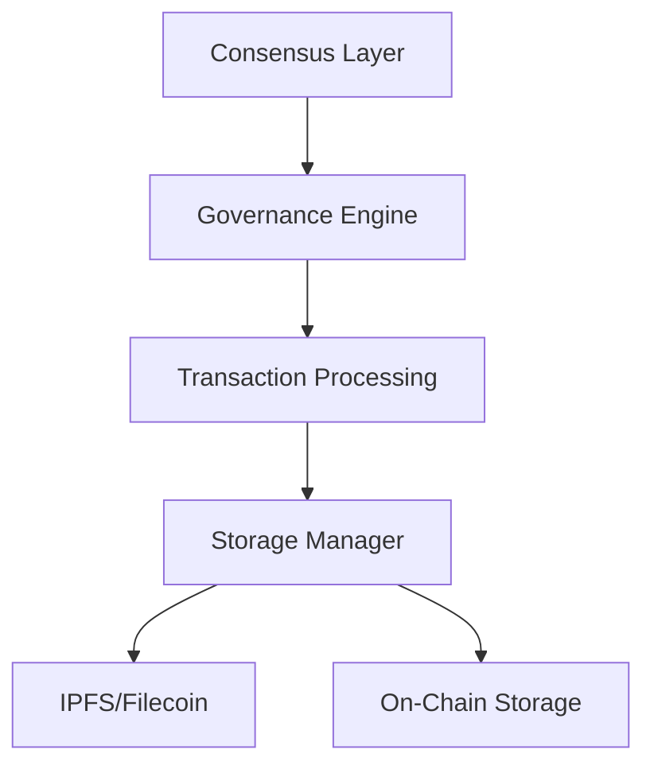

# Internet of Cooperative Networks (ICN)

A federated blockchain platform for cooperative resource sharing and governance.

## Table of Contents
- [Core Components](#core-components)
- [Architecture](#architecture)
- [Quick Start](#quick-start)
- [Project Structure](#project-structure)
- [Key Features](#key-features)
- [Usage](#usage)
- [Contributing](#contributing)
- [Testing](#testing)
- [Documentation](#documentation)
- [License](#license)

## Core Components

- **Consensus Engine**: Proof of Cooperation based consensus with democratic validator selection
- **Federated Ledger**: Distributed transaction processing with cooperative governance
- **DID Authentication**: Identity management using decentralized identifiers
- **Hybrid Storage**: Combined on-chain/off-chain storage model

## Architecture



## Quick Start

```bash
# Build the project
cargo build

# Run tests
cargo test

# Start a local testnet
cargo run --bin icn-node -- --testnet
```

## Project Structure
The ICN project is organized into several directories, each serving a specific purpose:

- **backend**: Contains the Rust code for the backend services.
- **frontend**: Contains the JavaScript code for the frontend application.
- **contracts**: Contains the smart contracts for governance and cooperative operations.
- **crates**: Contains various Rust crates used by the backend services.
- **docker**: Contains Dockerfiles and Docker Compose configurations for containerizing the services.
- **docs**: Contains the project documentation, including setup guides, contribution guides, and API documentation.
- **scripts**: Contains various scripts for setup, deployment, and management of the project.
- **config**: Contains configuration files for different environments and services.

## Key Features
- **Decentralized Identity Management**: Secure and verifiable identities using DIDs.
- **Reputation System**: Track and manage reputation across cooperatives.
- **Governance**: Democratic decision-making through proposals and voting.
- **Resource Sharing**: Efficient allocation and management of resources.
- **Consensus Mechanism**: Proof of Cooperation (PoC) for transaction validation.
- **Telemetry and Logging**: Integrated metrics and logging for monitoring and debugging.

## Usage
To run the ICN project locally, follow the instructions in the [Getting Started](#getting-started) section. For detailed usage instructions, refer to the [User Guides](docs/user/guides/index.md).

### Starting the Backend
```bash
# Navigate to the backend directory
cd backend

# Run the backend services
cargo run --bin icn-backend
```

### Starting the Frontend
```bash
# Navigate to the frontend directory
cd frontend

# Install dependencies
npm install

# Run the frontend application
npm start
```

## Contributing
We welcome contributions from the community! To get started, please read the [ICN Contribution Guide](docs/development/guides/contributing.md) for guidelines on how to contribute to the project.

## Testing
The ICN project uses a comprehensive testing strategy to ensure the quality and reliability of the codebase. For detailed information on the testing strategy and how to run tests, refer to the [ICN Testing Strategy Guide](docs/development/guides/test-strategy.md).

## Documentation
For detailed documentation, including the Development Setup Guide, ICN Contribution Guide, and other relevant documents, refer to the [Documentation Index](docs/INDEX.md).

- [Consensus Engine](./crates/icn-consensus/README.md)
- [Core Architecture](./crates/icn-core/README.md)
- [API Reference](./docs/api.md)
- [Governance Model](./docs/governance.md)

## License
This project is licensed under the MIT License. See the [LICENSE](LICENSE) file for more details.
