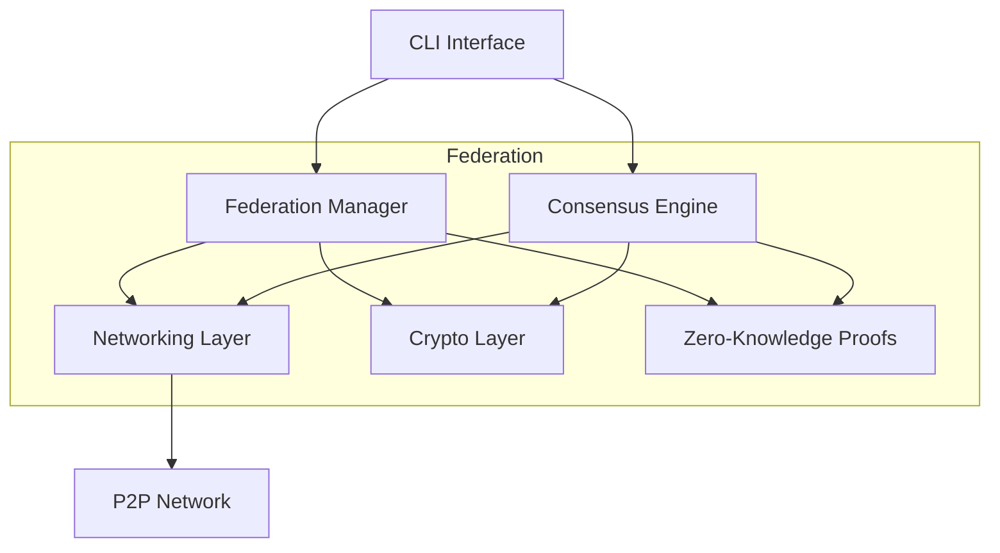

# ICN Architecture Overview

The Inter-Cooperative Network (ICN) is designed as a modular, distributed system that enables secure federation communications and resource sharing. This document provides an overview of the system architecture.

## System Components

### Core Components

1. **Federation Manager (`icn-federation`)**
   - Manages federation lifecycle and membership
   - Handles resource allocation and sharing
   - Implements federation governance rules
   - Processes cross-federation operations

2. **Consensus Engine (`icn-consensus`)**
   - Implements Proof of Cooperation consensus
   - Manages validator selection and rotation
   - Handles block creation and validation
   - Provides Byzantine fault tolerance

3. **Cryptographic Layer (`icn-crypto`)**
   - Implements key generation and management
   - Provides digital signatures and verification
   - Handles encryption/decryption operations
   - Supports multiple cryptographic algorithms

4. **Networking Layer (`icn-networking`)**
   - Implements Secure Datagram Protocol (SDP)
   - Manages peer-to-peer connections
   - Handles message routing and delivery
   - Provides NAT traversal capabilities

5. **Zero-Knowledge Proofs (`icn-zk`)**
   - Implements privacy-preserving verifications
   - Handles proof generation and validation
   - Supports resource verification
   - Enables confidential transactions

### Supporting Components

1. **CLI Interface (`icn-cli`)**
   - Provides command-line management tools
   - Supports federation operations
   - Enables resource management
   - Facilitates system monitoring

2. **Common Types (`icn-types`)**
   - Defines core data structures
   - Implements serialization
   - Provides type safety
   - Ensures compatibility

## Architecture Diagram



## Communication Flow

1. **Federation Formation**
   ```
   Client -> CLI -> Federation Manager -> Consensus Engine -> Network
   ```

2. **Resource Sharing**
   ```
   Federation A -> Network -> Federation B -> Consensus -> Execution
   ```

3. **Governance**
   ```
   Proposal -> Consensus -> Validation -> Execution -> State Update
   ```

## Security Model

The ICN implements multiple layers of security:

1. **Network Security**
   - Secure Datagram Protocol (SDP)
   - End-to-end encryption
   - Perfect forward secrecy
   - NAT traversal protection

2. **Consensus Security**
   - Byzantine fault tolerance
   - Sybil attack resistance
   - Stake-based validation
   - Reputation tracking

3. **Federation Security**
   - Multi-signature governance
   - Resource access control
   - Member authentication
   - Cross-federation verification

4. **Privacy**
   - Zero-knowledge proofs
   - Confidential transactions
   - Private state channels
   - Selective disclosure

## State Management

The system maintains several types of state:

1. **Federation State**
   - Member registry
   - Resource allocations
   - Governance proposals
   - Reputation scores

2. **Consensus State**
   - Validator set
   - Block history
   - Vote records
   - Round information

3. **Network State**
   - Peer connections
   - Message queues
   - Routing tables
   - Connection metrics

## Configuration

The system can be configured through multiple mechanisms:

1. **Environment Variables**
   - Basic settings
   - Network parameters
   - Security options

2. **Configuration Files**
   - Detailed settings
   - Federation rules
   - Resource limits

3. **Runtime Configuration**
   - Dynamic parameters
   - Tuning options
   - Feature flags

## Deployment

The ICN can be deployed in various configurations:

1. **Development**
   - Single node
   - Docker containers
   - Local network

2. **Testing**
   - Multiple nodes
   - Simulated network
   - Test federation

3. **Production**
   - Distributed nodes
   - High availability
   - Load balancing

## Future Enhancements

1. **Scalability**
   - Sharding support
   - Layer 2 solutions
   - State channels

2. **Interoperability**
   - Cross-chain bridges
   - Protocol adapters
   - Standard interfaces

3. **Privacy**
   - Advanced ZK circuits
   - Homomorphic encryption
   - Private transactions 