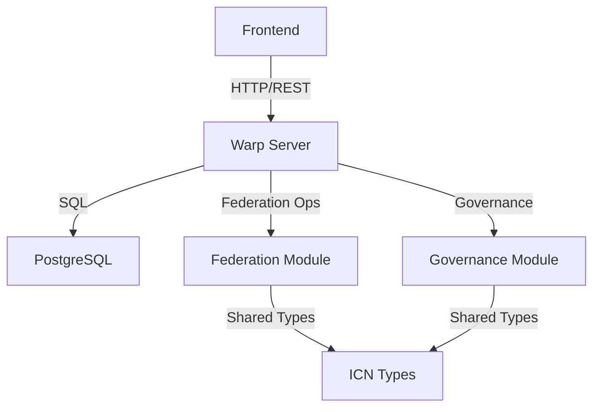
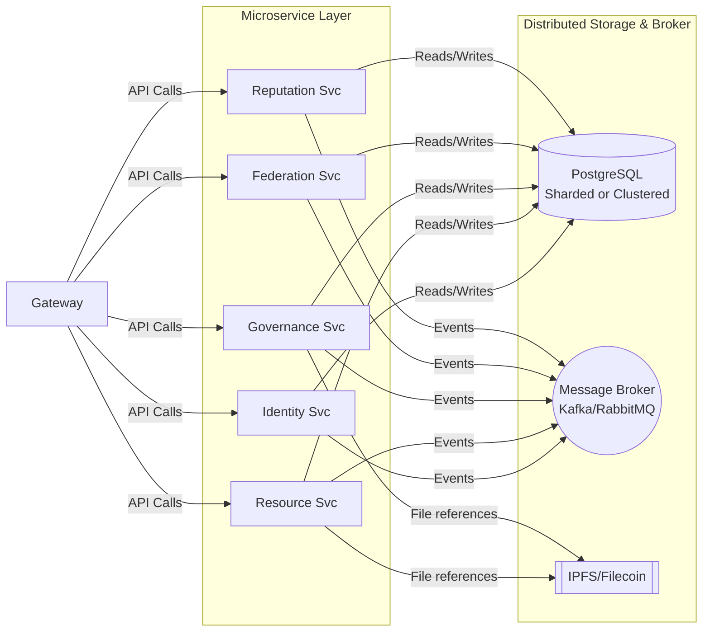

# System Architecture Overview

## Core Components

### Backend (Rust)
- Federation Management (`icn-federation`)
- Governance System (`icn-governance`)
- Resource Sharing (`icn-resources`)
- Core Types (`icn-types`)

### Frontend (React/TypeScript)
- SPA Architecture
- DID-based Authentication
- Accessibility-First Design

## Key Design Decisions

### Separation of Concerns
- Modular crate structure for maintainability
- Clear API boundaries between components
- Typed interfaces using shared models

### Security & Authentication
- DID-based identity management
- Zero-knowledge proofs for sensitive operations
- Role-based access control

### Data Flow


## Current Challenges & Mitigations

1. **Complexity Management**
   - Strict modularization
   - Comprehensive testing strategy
   - Clear documentation standards

2. **Integration Points**
   - Strong typing across boundaries
   - Integration test suite
   - Clear error handling patterns

3. **Governance Scalability**
   - Unified proposal/voting system
   - Automated validation
   - Clear audit trails

## Implementation Details

### Federation Module
```rust
pub struct Federation {
    id: FederationId,
    members: Vec<Member>,
    governance_config: GovernanceConfig,
    resources: ResourcePool,
}

impl Federation {
    pub async fn new(config: FederationConfig) -> Result<Self, FederationError>;
    pub async fn add_member(&mut self, member: Member) -> Result<(), MembershipError>;
    pub async fn remove_member(&mut self, member_id: MemberId) -> Result<(), GovernanceError>;
}
```

### Governance Module
```rust
pub struct Proposal {
    id: ProposalId,
    federation_id: FederationId,
    proposer: MemberId,
    action: GovernanceAction,
    status: ProposalStatus,
    votes: Vec<Vote>,
}

pub enum GovernanceAction {
    AddMember(Member),
    RemoveMember(MemberId),
    UpdateConfig(GovernanceConfig),
    AllocateResource(ResourceAllocation),
}
```

## Hierarchical Federation and Governance Models

### Hierarchical Federation Model
In the hierarchical federation model, smaller federations (e.g., regional co-ops) form local clusters that then federate upward into larger “umbrella” federations. This reduces excessive lateral communication across cooperatives and services.

#### Benefits:
- **Scalability:** Smaller federations handle local decisions, offloading the global layer.
- **Clarity:** Clear separation of responsibilities between local and global governance.
- **Performance:** Less broadcast overhead for proposals/voting, since only federated representatives escalate major decisions.

### Hierarchical Governance Model
In the hierarchical governance model, each smaller federation elects a representative to the next level, reducing the total number of governance messages across the entire network.

#### Benefits:
- **Scalability:** Smaller federations handle local decisions, offloading the global layer.
- **Clarity:** Clear separation of responsibilities between local and global governance.
- **Performance:** Less broadcast overhead for proposals/voting, since only federated representatives escalate major decisions.

### Updated Data Flow


- **Gateway**: Serves as the single entry point for external clients.
- **Microservices**: Each domain stands alone, exchanging messages via the **MQ** and persisting data to the **DB**.
- **IPFS**: Stores large resource files or additional proposal data off-chain.
- **Hierarchical Federations**: Externally, multiple federations connect at the **Federation Svc** for cross-federation coordination.
