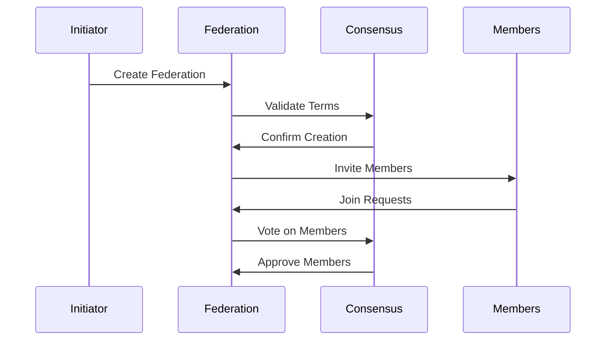
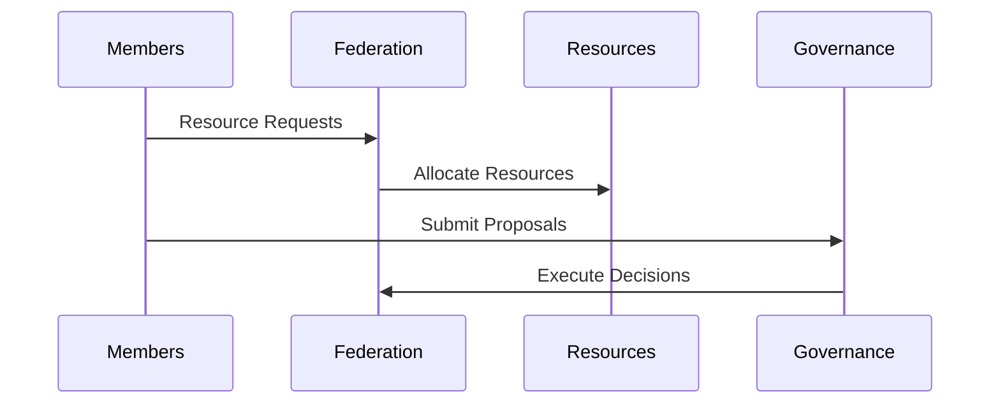
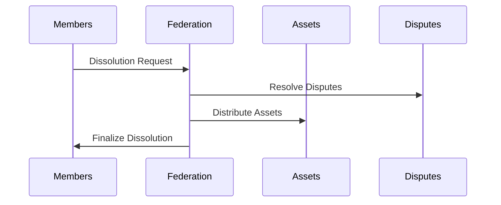

# ICN Federation Protocol

The ICN Federation Protocol defines how cooperative networks form, communicate, and share resources in a secure and decentralized manner.

## Protocol Overview

### Federation Types

```rust
pub enum FederationType {
    ResourceSharing,    // For resource pooling and sharing
    Governance,         // For joint decision making
    Research,          // For collaborative research
    Development,       // For joint development
    Hybrid,            // Combination of multiple types
    Custom(String),    // Custom federation type
}
```

### Federation Terms

```rust
pub struct FederationTerms {
    pub governance_rules: GovernanceRules,
    pub resource_rules: ResourceRules,
    pub membership_rules: MembershipRules,
    pub dispute_resolution_rules: DisputeResolutionRules,
    pub cross_federation_rules: CrossFederationRules,
}
```

## Federation Lifecycle

### 1. Formation



### 2. Operation



### 3. Dissolution



## Resource Management

### Resource Types

```rust
pub enum ResourceType {
    Compute,    // Computing resources
    Storage,    // Storage capacity
    Network,    // Network bandwidth
    Memory,     // Memory allocation
    Custom(String), // Custom resource type
}
```

### Allocation Strategy

```rust
pub enum AllocationStrategy {
    EqualShare,              // Equal distribution
    ProportionalToContribution, // Based on contribution
    NeedsBasedPriority,     // Based on needs
    Custom(String),         // Custom strategy
}
```

## Governance

### Proposal Types

```rust
pub enum ProposalType {
    MembershipChange(MembershipAction),
    ResourceAllocation(ResourceAllocationDetails),
    GovernanceUpdate(GovernanceUpdateDetails),
    FederationTermsUpdate(FederationTermsUpdateDetails),
    Custom(String),
}
```

### Voting Process

1. **Submission**
   - Member submits proposal
   - Proposal is validated
   - Voting period begins

2. **Voting**
   - Members cast votes
   - Votes are weighted by reputation
   - Quorum is checked

3. **Execution**
   - Proposal is approved/rejected
   - Actions are executed
   - State is updated

## Security

### 1. Authentication

- Digital signatures for all operations
- Multi-signature requirements for critical actions
- Identity verification through DIDs

### 2. Authorization

```rust
pub enum MemberRole {
    Admin,           // Full administrative rights
    Member,          // Standard member rights
    Observer,        // Read-only access
    Arbitrator,      // Dispute resolution rights
    ResourceProvider, // Resource management rights
    Custom(String),  // Custom role
}
```

### 3. Access Control

```rust
pub enum SharingPolicy {
    Unrestricted,     // Open access
    MembersOnly,      // Federation members only
    ApprovalRequired, // Requires approval
    Custom(String),   // Custom policy
}
```

## Dispute Resolution

### Dispute Types

```rust
pub enum DisputeType {
    ResourceAllocation,  // Resource conflicts
    Governance,         // Governance disputes
    Membership,         // Member conflicts
    TermsViolation,    // Terms violations
    Custom(String),    // Custom disputes
}
```

### Resolution Process

1. **Filing**
   - Dispute is filed
   - Evidence is collected
   - Arbitrators are selected

2. **Review**
   - Evidence is verified
   - Parties are heard
   - Resolution is proposed

3. **Resolution**
   - Decision is made
   - Actions are executed
   - Appeals are handled

## Cross-Federation Operations

### 1. Resource Sharing

```rust
pub struct CrossFederationRules {
    pub allowed_federation_types: Vec<FederationType>,
    pub resource_sharing_limits: HashMap<ResourceType, u64>,
    pub min_reputation_requirement: f64,
    pub governance_participation: GovernanceParticipation,
}
```

### 2. Dispute Handling

```rust
pub struct FederationDispute {
    pub id: String,
    pub initiator: String,
    pub respondent: String,
    pub dispute_type: DisputeType,
    pub evidence: Vec<Evidence>,
    pub status: DisputeStatus,
    pub resolution: Option<DisputeResolution>,
}
```

## Protocol Extensions

### 1. Custom Types

- Federation types can be extended
- Resource types can be customized
- Governance rules can be modified

### 2. Plugin System

- Custom allocation strategies
- Custom dispute resolution
- Custom voting mechanisms

## Implementation Guide

### 1. Creating a Federation

```rust
let federation = Federation::new(
    "federation_id",
    vec!["member1", "member2"],
    FederationType::ResourceSharing,
    federation_terms,
);
```

### 2. Managing Resources

```rust
federation.allocate_resources(
    ResourceAllocationDetails {
        resource_type: ResourceType::Compute,
        amount: 1000,
        recipient: "member1",
        duration: Some(Duration::from_hours(24)),
    }
)?;
```

### 3. Handling Governance

```rust
federation.submit_proposal(
    "title",
    "description",
    "creator",
    proposal_deadline,
)?;

federation.vote(
    proposal_id,
    "voter",
    true,
)?;
```

## Best Practices

1. **Security**
   - Always verify signatures
   - Implement rate limiting
   - Use secure communication

2. **Performance**
   - Cache frequent operations
   - Batch transactions
   - Use efficient serialization

3. **Reliability**
   - Implement retries
   - Handle timeouts
   - Log all operations

## Error Handling

```rust
pub enum FederationError {
    #[error("Federation not found: {0}")]
    FederationNotFound(String),
    
    #[error("Member already exists: {0}")]
    AlreadyMember(String),
    
    #[error("Member not found: {0}")]
    MemberNotFound(String),
    
    #[error("Insufficient resources: {0}")]
    InsufficientResources(String),
    
    #[error("Invalid proposal: {0}")]
    InvalidProposal(String),
}
``` 